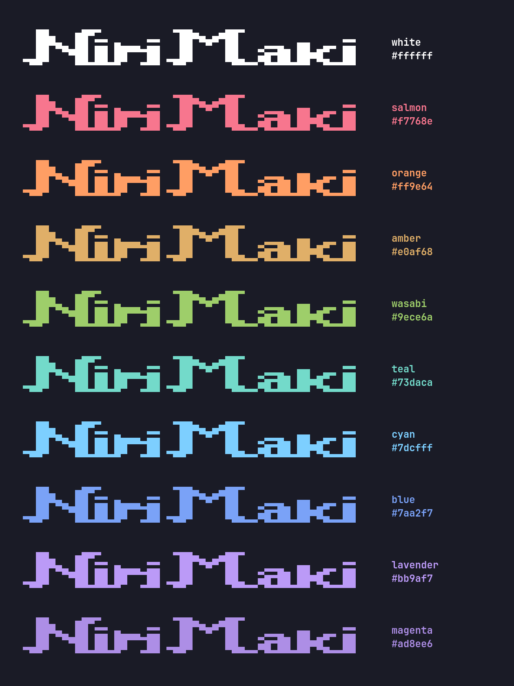

<div align="center">


**Niri + Maki.** An Omarchy-style desktop for Arch Linux, built on [niri] and [Quickshell].


</div>

[niri]:      https://github.com/YaLTeR/niri
[Quickshell]: https://quickshell.outfoxxed.me/

---

## What it is

[Omarchy] is **omakase** (chef's choice) + **Arch** — a curated, opinionated
Arch desktop on top of Hyprland. Nirimaki is the same idea, retold for niri's
scrolling-column world: **niri + maki**, the rolled sushi answer to Omarchy's
plate. Same opinionated baseline (themes, dialogs, lock screen, picker
overlays, sane keybinds), different compositor underneath.

[Omarchy]: https://omarchy.org

It's a single repo you can drop on a fresh Arch install and end up with a
working, themed, multi-monitor desktop — without hand-stitching ten dotfile
sources together first.

---

## What you get

### Baseline (always shipped)

- **Compositor**: niri 26.04+ tuned for scrolling-column workflow,
  variable-refresh-rate outputs, German keymap, focus-follows-mouse.
- **Shell**: Quickshell. Top bar with workspaces, active-window title,
  audio, network, bluetooth, weather, system stats, calendar, tray,
  updates. Notification stack. OSD bezel for volume / brightness.
- **Dialog overlays** (Omarchy walker-style, all behind one
  [`DialogShell`](config/quickshell/DialogShell.qml) component): app
  launcher, power menu, theme picker, background picker, language
  picker, clipboard history, emoji picker, settings drilldown,
  keybind cheat-sheet.
- **22 themes** under `config/theme/themes/` — imported from Omarchy
  plus custom additions (`catppuccin`, `gruvbox`, `tokyo-night`,
  `nord`, `rose-pine`, `kanagawa`, `everforest`, `solitude`,
  `hackerman`, `retro-82`, …). One `nirimaki theme set <name>`
  re-skins niri / Quickshell / foot / btop / Qt apps / Chromium live.
- **Three browsers shipped**: Zen (default), Firefox, Chromium.
  Settings menu has a default-browser picker. Chromium specifically
  is used for the webapp installer (live-themable via Chrome's
  managed-policy system) regardless of default.
- **Terminal stack**: foot (default) + fish (chsh'd) + starship +
  eza/bat/fzf/zoxide/ripgrep/fd/delta/lazygit/tmux/yazi/nvim
  (LazyVim). Quake terminal on `Mod+grave`. Theme swap re-skins bat,
  delta, fish syntax, yazi, lazygit, starship, foot (via OSC palette
  sequences), tmux, every running nvim, and Chromium chrome live.
- **Wallpaper per theme**: each theme ships its own backgrounds;
  swap follows the theme.
- **Lock screen**: PAM-backed, i18n, wallpaper-aware backdrop.
- **i18n**: `en` + `de` translations, runtime locale switcher.
- **Transparency** dialed to Omarchy parity (per-app opacity rules,
  always-opaque media tools, screen-capture blocking on password
  managers).
- **Branded boot**: UKI splash + Plymouth assets in `assets/`.

### Optional features (`Mod+Alt+Space → Install`)

State-aware install/remove menu — entries hide for features that are
already in the desired state. Each install runs in a foot window
with one sudo prompt + the Nirimaki banner. Full per-feature
details (auth flows, persistence, configs written) in
[`docs/optional-features.md`](docs/optional-features.md).

| Category | Features                                  |
|----------|-------------------------------------------|
| AI       | Voxtype (voice dictation, `Mod+F9`)       |
| Service  | Tailscale (mesh VPN), Bitwarden           |
| Editor   | VS Code, Helix                            |
| Gaming   | Steam (auto-detects GPU for lib32 stack)  |
| Web App  | Any URL → standalone Chromium window with own profile, theme-aware chrome |

### Unified CLI

`bin/nirimaki` is the dispatcher; everything is reachable via
`nirimaki <group> <action>`:

```
nirimaki theme set tokyo-night
nirimaki webapp install
nirimaki browser default zen
nirimaki voxtype install
nirimaki audio output volume raise
nirimaki help
```

Each backing script (`bin/nirimaki-<group>-<action>`) carries its own
`# nirimaki:summary=` / `args=` / `group=` metadata header. The
dispatcher builds `nirimaki help` from those — no central registry.

---

## Quick start (live dev mode)

```bash
git clone https://github.com/kingkill85/nirimaki.git ~/Projekte/kingkill85/nirimaki
cd ~/Projekte/kingkill85/nirimaki
./dev-link.sh
```

`dev-link.sh` replaces

```
~/.config/niri/                 →  this repo's config/niri/
~/.config/quickshell/           →                config/quickshell/
~/.config/fish/                 →                config/fish/
~/.config/foot/                 →                config/foot/
~/.config/tmux/                 →                config/tmux/
~/.config/nvim/                 →                config/nvim/
~/.config/theme/templates/      →                config/theme/templates/
~/.config/theme/themes/         →                config/theme/themes/
~/.config/nirimaki/             →  per-file (hooks/extensions/themed samples)
~/.local/bin/nirimaki-*         →                bin/nirimaki-*
~/.local/share/applications/*   →  per-file (repo-owned .desktop entries)
```

with symlinks back into the repo. Anything you already had at those
paths is moved to `<path>.pre-link` first as a backup. Idempotent;
re-runnable after `git pull`. Dangling `qs-*` symlinks from the
pre-Phase-J naming are pruned automatically.

After linking, edit any file in the repo and it's live: niri
auto-reloads, Quickshell needs a quick:

```bash
quickshell list --all 2>&1 | grep "Process ID" | awk '{print $3}' | xargs -r kill
quickshell -p ~/.config/quickshell/shell.qml &
```

### One-time machine setup

A handful of things need a single `sudo` per machine (no install.sh
yet — these are documented in the relevant phase docs and replicated
here for convenience):

```bash
# Chromium live-theming policy dir (Phase I) — required for webapp
# chrome to follow the active Nirimaki theme:
sudo mkdir -p /etc/chromium/policies/managed
sudo chmod a+rw /etc/chromium/policies/managed

# Fish as login shell (Phase H):
chsh -s /usr/bin/fish
```

After that, `nirimaki theme set <name>` and the SettingsMenu run
sudo-free.

---

## User customisation surface

Drop files into `~/.config/nirimaki/` — these are the only places
users should be editing:

| Want to…                            | Drop a file at                                       |
|-------------------------------------|------------------------------------------------------|
| React to theme changes              | `~/.config/nirimaki/hooks/theme-set.d/<name>` (+x)   |
| React to install / remove events    | `~/.config/nirimaki/hooks/{voxtype,steam,…}-{installed,removed}.d/<name>` (+x) |
| Add a SettingsMenu entry            | `~/.config/nirimaki/extensions/menu.json`            |
| Override how an app gets themed     | `~/.config/nirimaki/themed/<base>.tpl`               |

Samples ship at `config/nirimaki/*` and dev-link symlinks each into
`~/.config/nirimaki/`. Schema details + examples in
[`docs/phase-j-platform.md`](docs/phase-j-platform.md).

---

## Fresh-install on blank Arch (planned, not yet shipped)

The end goal — `./install.sh` on a barebones Arch install gives you a
themed, working Nirimaki desktop in one go:

1. `pacman` + AUR install from `packages.txt`.
2. Copy (not symlink) `config/*` → `~/.config/`, `bin/*` → `~/.local/bin/`.
3. Template `keybinds.kdl` spawn paths to the user's `$HOME`.
4. Enable systemd units (`swayidle`, `niri-session.target`, …).
5. One-time sudo setup (chromium policy dir chmod, multilib enable).
6. `nirimaki theme set default` → materialise the active theme.

Per-phase install requirements are documented at the bottom of each
phase doc (search for "What an install.sh must do for this phase").

---

## Repo layout

```
config/
  niri/         compositor config (config.kdl, keybinds.kdl)
  quickshell/   bar, DialogShell, dialogs, lock screen, i18n,
                services (Niri/Notification/Updates/PopupBus),
                settings-menu.json (the JSON tree the menu loads)
  fish/         config.fish + conf.d/ + functions/ (bm, tdl, …)
  foot/         foot.ini (font, padding, key-bindings)
  tmux/         tmux.conf (Omarchy port — C-Space prefix, vi-mode)
  nvim/         LazyVim starter + Nirimaki theme hot-reload glue
  theme/
    templates/  per-app .tpl rendered by nirimaki-theme-set
    themes/     22 themes (colors.toml + backgrounds + previews)
  nirimaki/     user-overrides skeleton (hooks/extensions/themed
                samples — get symlinked into ~/.config/nirimaki/)
  applications/ repo-owned .desktop launchers
bin/            nirimaki (dispatcher) + nirimaki-<group>-<action>
                helpers: theme-set/list, webapp-*, browser-*,
                voxtype-*, tailscale-*, bitwarden-*, vscode-*,
                helix-*, steam-*, hook-run, feature-state,
                feature-prelude, …
docs/           phase-a-foundations.md … phase-j-platform.md,
                optional-features.md, install-steps.md
assets/         logo (ASCII source + 11 coloured PNG variants),
                splash.bmp, plymouth/
scripts/        ascii2png.sh (logo rendering pipeline)
dev-link.sh     ↑ described above
```

---

## Docs

Each phase under [`docs/`](docs/) has an `### Outcome` section
describing the actual end state — not the original plan, but what
shipped. Read those first if you want to know **why** something is
the way it is.

| Phase | What |
|------:|------|
| A | Foundations — niri install, kdl basics, outputs |
| B | Shell — Quickshell bar, widgets, services |
| C | Polish — popups, animations, hotkey overlay |
| D | Theming — palette generator, templates pipeline, Plymouth + UKI branding |
| E | Consistency — Omarchy themes import, blur, transparency, single-popup bus |
| F | i18n + keybinds — I18n singleton, `keybinds.kdl`, KeybindSheet, lock-screen i18n |
| G | Settings dialogs — drilldown, pickers, runtime locale switcher |
| H | Terminal — fish + starship + modern CLI toolkit + tmux + LazyVim; **kitty → foot** swap, OSC live-recolour |
| I | Webapps + browsers — Chromium live theming, default-browser picker, webapp installer |
| J | Platform — unified `nirimaki` CLI dispatcher, JSON-driven menu, hooks + extensions + themed user-overrides |

[`docs/optional-features.md`](docs/optional-features.md) covers
everything installable beyond the baseline (Voxtype, Tailscale,
Bitwarden, Steam, VS Code, Helix).

`install.sh` is the remaining big piece.

---

## License

MIT — see [`LICENSE`](LICENSE).

<div align="center">



*Eleven recoloured logo variants ship in `assets/`. Pick your accent.*

</div>
