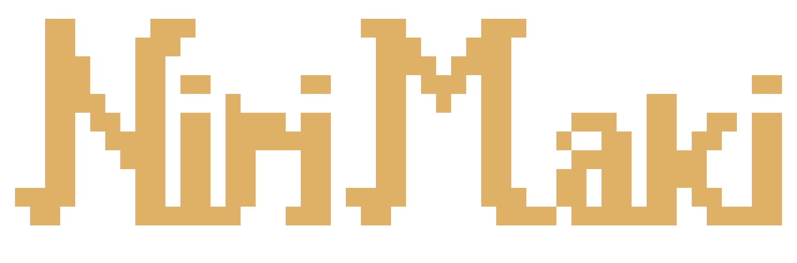

<div align="center">



**Niri + Maki.** An Omarchy-style desktop for Arch (and Arch-based distros), built on [niri] and [Quickshell].


</div>

[niri]:       https://github.com/YaLTeR/niri
[Quickshell]: https://quickshell.outfoxxed.me/
[Omarchy]:    https://omarchy.org

---

## What it is

[Omarchy] is **omakase** (chef's choice) + **Arch** — a curated, opinionated
Arch desktop on top of Hyprland. **Nirimaki** is the same idea retold for
niri's scrolling-column world: **niri + maki**, the rolled sushi answer to
Omarchy's plate. Same opinionated baseline (themes, dialogs, lock screen,
pickers, sane keybinds), different compositor underneath.

Drop it on a fresh Arch or Arch-based install (CachyOS, EndeavourOS, and
friends — anything with `/etc/arch-release` and `pacman`) — themed, working,
multi-monitor desktop in one command. No hand-stitching ten dotfile sources
together first.

---

## Install

From a freshly-installed Arch or Arch-based box — vanilla Arch (`archinstall`
Minimal is enough), CachyOS, EndeavourOS, etc. install.sh handles the rest:

```bash
curl -fsSL https://raw.githubusercontent.com/kingkill85/nirimaki/main/boot.sh | bash
```

The pipe form runs cleanly under any login shell — CachyOS and a handful
of other Arch-based distros default to fish, which doesn't grok bash's
`<(…)` process substitution.

That's the whole thing. `boot.sh` installs `git`, clones the repo to
`~/.local/share/nirimaki/`, and hands off to `install.sh` — which prompts for
sudo **once**, then runs unattended (~15 min depending on mirror speed).

What you'll get afterward: SDDM greeter on next boot, niri session,
themed Quickshell bar, fish as your login shell, every CLI tool in the
phase-H lineup, and a working `nirimaki` command for everything else.

### Updating

```bash
nirimaki update      # or: bin/nirimaki-update
```

`nirimaki-update` does: `git pull` → run any pending [migrations](#migrations)
→ `paru -Syu` (system + AUR) → reload niri config → fire `post-update.d/`
hooks → offer reboot if kernel/niri changed.

---

## What you get

**Compositor + shell.** niri 26.04+ tuned for scrolling-column workflow
with VRR + German keymap. Quickshell bar (workspaces, audio, network,
bluetooth, weather, system stats, calendar, tray, updates), notification
stack, OSD bezel.

**Dialog overlays** (one [`DialogShell`](config/quickshell/DialogShell.qml)
component, walker-style): launcher, power menu, theme picker, background
picker, language picker, clipboard history, emoji picker, settings
drilldown, keybind cheat-sheet.

**22 themes** under `config/theme/themes/` — `catppuccin`, `gruvbox`,
`tokyo-night`, `nord`, `rose-pine`, `kanagawa`, `everforest`, `solitude`,
`hackerman`, `retro-82`, … One `nirimaki theme set <name>` re-skins niri,
Quickshell, foot, btop, Qt apps, Chromium chrome, bat/delta/fish/yazi/
lazygit/starship/tmux, and every running nvim, live.

**Three browsers.** Zen (default), Firefox, Chromium. Chromium is used
for the webapp installer because of live-themable managed-policy support.

**Terminal stack.** foot + fish + starship + eza/bat/fzf/zoxide/ripgrep/
fd/delta/lazygit/tmux/yazi/nvim (LazyVim). Quake terminal on `Mod+grave`.

**Branded boot.** Plymouth splash + UKI splash. SDDM theme follows the
active Nirimaki theme (same palette + wallpaper as the lock screen).

**Lock screen.** PAM-backed, i18n, wallpaper-aware backdrop.

**i18n.** `en` + `de`, runtime switcher.

### Optional features (`Mod+Alt+Space → Install`)

State-aware install/remove menu. Each entry hides when already in the
target state. Full per-feature details in
[`docs/optional-features.md`](docs/optional-features.md).

| Category | Features                                  |
|----------|-------------------------------------------|
| AI       | Voxtype (voice dictation, `Mod+F9`)       |
| Service  | Tailscale, Bitwarden                      |
| Editor   | VS Code, Helix                            |
| Gaming   | Steam (auto-detects GPU for lib32 stack)  |
| Web App  | Any URL → standalone Chromium window, own profile, theme-aware chrome |

### Unified CLI

`bin/nirimaki` is the dispatcher; everything is reachable via
`nirimaki <group> <action>`:

```
nirimaki theme set tokyo-night
nirimaki webapp install
nirimaki browser default zen
nirimaki voxtype install
nirimaki update
nirimaki help
```

Each backing script (`bin/nirimaki-<group>-<action>`) carries its own
`# nirimaki:summary=` / `args=` metadata header. The dispatcher builds
`nirimaki help` from those — no central registry.

---

## User customisation

| Want to…                            | Drop a file at                                                              |
|-------------------------------------|-----------------------------------------------------------------------------|
| Configure monitors                  | `~/.config/niri/monitors.kdl`                                               |
| Add / override niri keybinds        | `~/.config/niri/bindings.kdl`                                               |
| Customise foot / tmux / fish        | `~/.config/{foot/foot.ini,tmux/tmux.conf,fish/config.fish}`                  |
| React to theme change               | `~/.config/nirimaki/hooks/theme-set.d/<name>` (+x)                          |
| React to install / remove           | `~/.config/nirimaki/hooks/{voxtype,steam,…}-{installed,removed}.d/<name>` (+x) |
| Add a SettingsMenu entry            | `~/.config/nirimaki/extensions/menu.json`                                   |
| Override how an app gets themed     | `~/.config/nirimaki/themed/<base>.tpl`                                      |

User files are **copy-once** seeds — `git pull` / `nirimaki update`
never overwrite them. Samples live at `config/nirimaki/*`; install.sh
seeds them on first run.

---

## Migrations

When a commit touches a **system-owned** file (e.g. a Plymouth asset under
`/usr/share/plymouth/themes/qs-minimal/`), `git pull` alone can't refresh
existing installs — those files were copied with sudo, not symlinked.

The fix: a one-off script at `migrations/<unix-timestamp>.sh` committed
alongside the change. `nirimaki-update` runs unmarked migrations between
`git pull` and `paru -Syu`; state markers at
`~/.local/state/nirimaki/migrations/` ensure each runs once. Fresh installs
auto-skip them (install.sh pre-marks every shipped migration). Pattern
mirrors `basecamp/omarchy`.

---

## Dev mode (contributing)

Working **on** Nirimaki (not just running it)? Skip `install.sh` and use
`dev-link.sh` instead — it symlinks the repo into the live config so edits
take effect immediately:

```bash
git clone https://github.com/kingkill85/nirimaki.git ~/Projekte/kingkill85/nirimaki
cd ~/Projekte/kingkill85/nirimaki
./dev-link.sh
```

Anything you had at the target paths is moved to `<path>.pre-link` first
as a backup. Idempotent; re-runnable after `git pull`. Niri auto-reloads;
Quickshell needs:

```bash
quickshell list --all 2>&1 | grep "Process ID" | awk '{print $3}' | xargs -r kill
quickshell -p ~/.config/quickshell/shell.qml &
```

See [`CLAUDE.md`](CLAUDE.md) for repo conventions, the user-file vs
repo-file boundary, and other gotchas.

---

## Repo layout

```
boot.sh         curl-pipe bootstrap (installs git, clones, runs install.sh)
install.sh      blank box → working Nirimaki, top-level
install/        per-phase install scripts (helpers, preflight, packaging,
                config, shell-setup, theme-apply, login, plymouth, verify)
migrations/     run-once upgrade scripts for system-owned changes
dev-link.sh     dev-mode symlinker (alternative to install.sh)
bin/            nirimaki dispatcher + nirimaki-<group>-<action> helpers
                + nirimaki-update + nirimaki-migrate
config/
  niri/         user-side niri seeds (config.kdl entry-point + stubs)
  quickshell/   bar, DialogShell, dialogs, lock screen, i18n, services
  fish/ foot/ tmux/ nvim/   shell + terminal + editor configs
  theme/
    templates/  per-app .tpl rendered by nirimaki-theme-set
    themes/     22 themes (colors.toml + backgrounds + previews)
  nirimaki/     user-overrides skeleton (hooks/extensions/themed samples)
  applications/ repo-owned .desktop launchers
default/        upgrade-tracked niri defaults + bash rc + SDDM theme
docs/           phase-a … phase-j outcomes + install-steps + optional-features
assets/         logo (ASCII source + 11 PNG variants), splash.bmp, plymouth/
scripts/        ascii2png.sh (logo rendering pipeline)
```

---

## Docs

Each phase under [`docs/`](docs/) has an `### Outcome` section — what
actually shipped, not the original plan. Read those first if you want to
know **why** something is the way it is.

| Phase | What |
|------:|------|
| A | Foundations — niri install, kdl basics, outputs, fontconfig |
| B | Shell — Quickshell bar, widgets, services |
| C | Polish — popups, animations, hotkey overlay |
| D | Theming — palette generator, templates pipeline, Plymouth + UKI |
| E | Consistency — Omarchy themes import, blur, transparency, popup bus |
| F | i18n + keybinds — I18n singleton, KeybindSheet, lock-screen i18n |
| G | Settings dialogs — drilldown, pickers, runtime locale switcher |
| H | Terminal — fish + starship + modern CLI + tmux + LazyVim + foot |
| I | Webapps + browsers — Chromium live theming, default-browser picker |
| J | Platform — unified `nirimaki` CLI, JSON menu, hooks + extensions |

Optional features → [`docs/optional-features.md`](docs/optional-features.md).
install.sh spec → [`docs/install-steps.md`](docs/install-steps.md).

---

## License

MIT — see [`LICENSE`](LICENSE).
